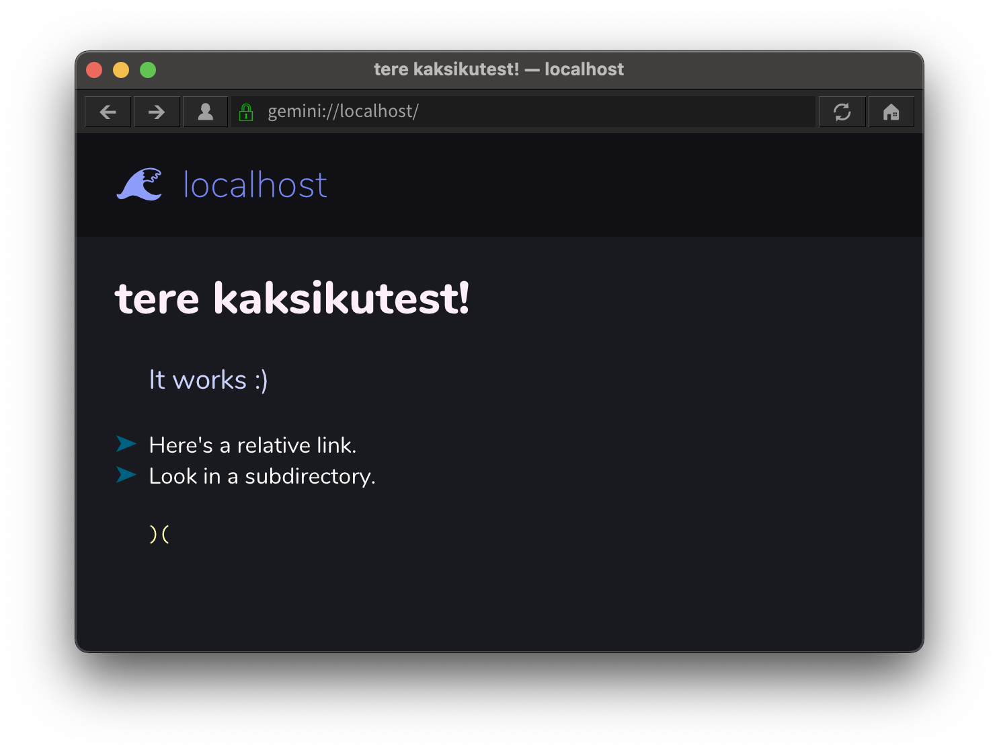

# kaksikud

Simple Gemini server in Zig.

## getting started

Build:

```console
zig build
```

Make a `config.zzz` with your vhost(s) and listen port.
_kaksikud_ does not terminate TLS for you — it'll need to be put behind a reverse proxy.
[`reverse-proxy`](./reverse-proxy) is a Ruby script for help with development.

```zzz
port: 1234

gemini.your.website:
  root: /path/to/root
```

## screenshot of it working



Viewed in [Lagrange](https://github.com/skyjake/lagrange).

## warning

If you use any of this in production, I will be so sad.

## license

Copyright 2021 Asherah Connor, [MIT](./LICENSE)-licensed.
